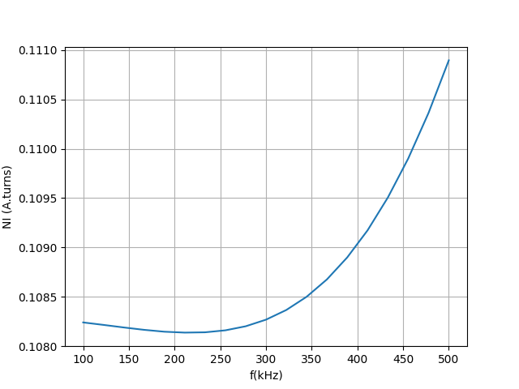

# Frequency Domain Simulation

## Introduction

In this section of the repository, the code focuses on computing the losses within the ferrite core, but only in the frequency domain. The formulation is therefore simplified by substituting the time derivatives with $j \omega$.

As a consequence, the equations involve complex values. Fortunately, [MFEM](https://mfem.org) supports complex-valued linear systems, either by using iterative solvers (PCG, MINRES, GMRES) combined with a preconditioner, or, if compiled with MPI support and SuperLU, through the direct solver SuperLU. For reference, see [example 35](https://github.com/mfem/mfem/blob/master/examples/ex35p.cpp)
in the MFEM documentation.


## Organisation of the code
### C++ Code
This file contains C++ code dedicated to the Finite Element formulation and the solution of the resulting linear system.

The implementation can be found in the `cpp_code/` folder: function declarations are located in `cpp_code/solver.hpp`, while their definitions are provided in `cpp_code/solver.cpp`.

The `simFD.cpp` file is used to call the various functions defined in solver.cpp. It also accepts different execution arguments, allowing the user to modify the simulation settings.


The program accepts several command-line arguments:

| Option | Long form        | Description |
|--------|-----------------|-------------|
| `-p`   | `--path`        | Path to the mesh file |
| `-f`   | `--frequency`   | Simulation frequency (Hz) |
| `-d`   | `--material`    | Ferrite properties: ρ (density), σ (conductivity), ε (permittivity) |
| `-u`   | `--permeability`| Magnetic permeability: μ_DC, f_c |
| `-b`   | `--b_peak`      | Average $b_{peak}$ on the surface (mT) |
| `-ni`  | `--NI`          | Current in the coil (A.turns) |
| `-v`   | `--visualization` | `1`: enable GLvis, `0`: disable |

> **Note:** `b` and `NI` cannot be imposed simultaneously. If both are given, only `b` will be considered.

By default, without any parameters, running the program is equivalent to:

```bash
simFD -p ../../mesh/square.msh -f 100e3 -d "5.98e-2, 4.44e-1, 2.48e-6" -u "4300 1.8e6" -b 10 -v 0
```
This means the simulation runs with the mesh `ferrite_loss/mesh/square.msh` at a frequency of 100 kHz, with an imposed value of $b_{peak} = 10$ mT, using the material parameters of a N30 ferrite core.


### Python Code
For convenience, a Python script [`Frequency_range.py`](Frequency_range.py) has been added.  
It allows you to:
- Run simulations over a range of frequencies with preset parameters (via [subprocess](https://docs.python.org/3/library/subprocess.html))
- Plot results of power losses and compare them directly with measured data, using well-known Python libraries such as [pandas](https://pandas.pydata.org/), [numpy](https://numpy.org/), and [matplotlib](https://matplotlib.org/)

>Recall that some measured data are available in a csv format in the folder `ferrit_loss/measurements_data` 


For example, here is the plot of the measured and simulated losses inside a ferrite N30.

<p align="center">
  
</p>

The simulation provides the computed magnetic flux ϕ and the current NI (with one of them being imposed). These quantities can also be plotted as a function of frequency.


The figure below shows the current NI (in A·turns) obtained by imposing a peak flux density $b_\text{peak} = 15 ,\text{mT}$ on an N30 ferrite core for different frequencies.

<p align="center">
  
</p>