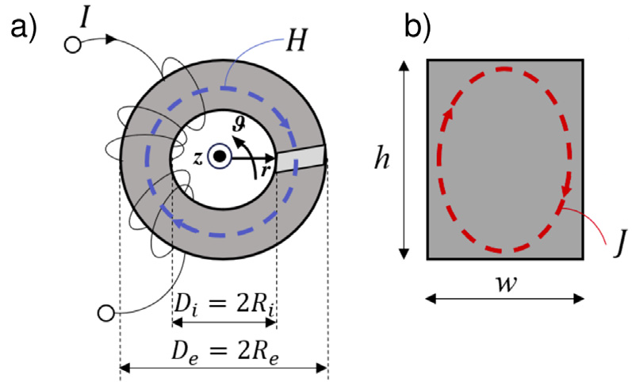
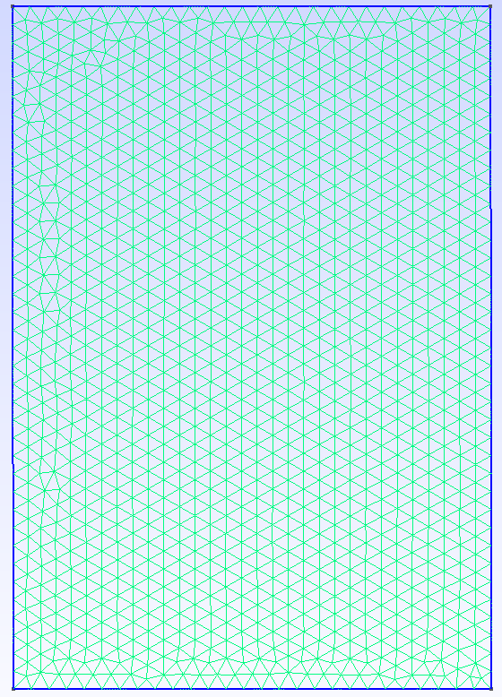
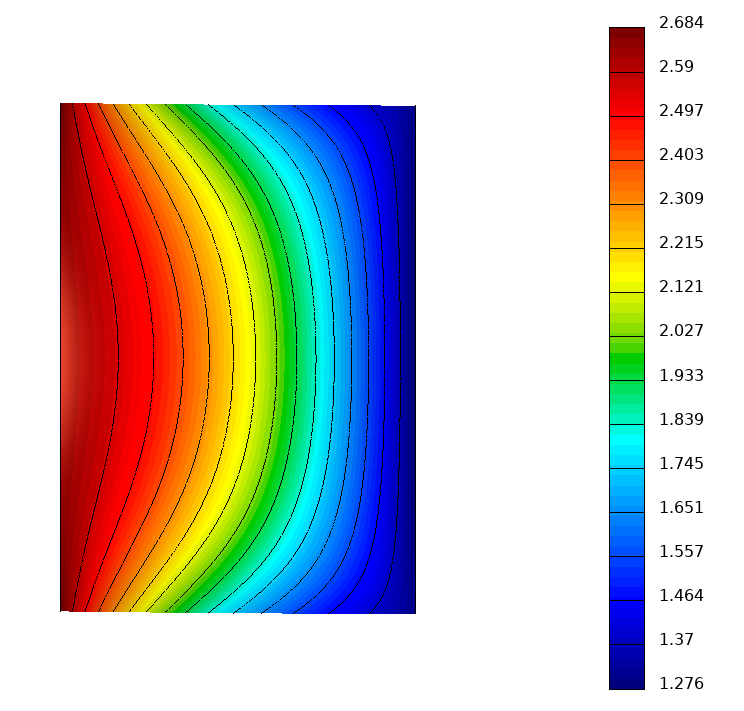
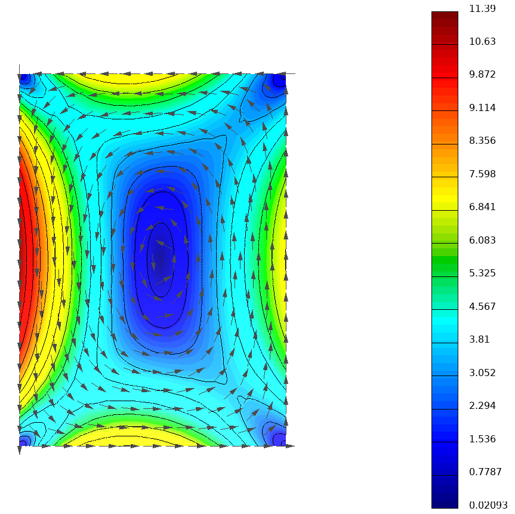

# Ferrite Core Loss Simulation

This repository contains the code used in a research project conducted by the **University of Perugia, Italy**, focusing on the **computation of magnetic losses in ferrite cores** using the Finite Element Method (FEM).

---

## Table of Contents
1. [Overview](#overview)
2. [Problem Description](#problem-description)
3. [Software Dependencies](#software-dependencies)
5. [Ferrite Core Model and Mesh](#ferrite-core-model-and-mesh)

---

## Overview
Ferrite cores are widely used in power electronics, with operating frequencies continuously increasing.  
Accurate predictive models are crucial for estimating magnetic losses and optimizing component design.

This project provides numerical models to simulate magnetic losses using the **Finite Element Method (FEM)**, with two main modeling approaches:
- **Frequency-domain modeling**
- **Time-domain modeling**, including reduced-order modeling based on **Proper Orthogonal Decomposition (POD)**

---

## Problem Description
Magnetic losses in ferrite materials depend on frequency, geometry, and the applied magnetic field.  
Being able to predict these losses accurately enables better performance in power converters, transformers, and inductors.

The goal of this repository is to offer an open-source implementation of FEM-based loss computation for ferrite cores, enabling:
- Reproducible simulations
- Comparison between frequency-domain and time-domain methods
- Testing of reduced-order modeling techniques

---

## Software Dependencies
This code relies on the following open-source libraries:
- [**MFEM**](https://mfem.org/) — Finite Element Method library
- [**libROM**](https://www.librom.net/) — Reduced Order Modeling library

> Make sure these libraries are installed and properly linked before building the project.

---

## Ferrite Core Model and Mesh
The model simulates the magnetic field inside a **toroidal ferrite core**, as shown below:

  

Since the problem is **axisymmetric**, only the cross-section of the toroidal ferrite core needs to be modeled.

The mesh is a **2D rectangular mesh** generated with [gmsh](https://gmsh.info/) and stored in the `mesh/` folder:

  

Here are some results plotted using [Glvis](https://glvis.org/). On the left is the magnetic field H (A/m), and on the right is the current density J (A/m2) 

  
  

